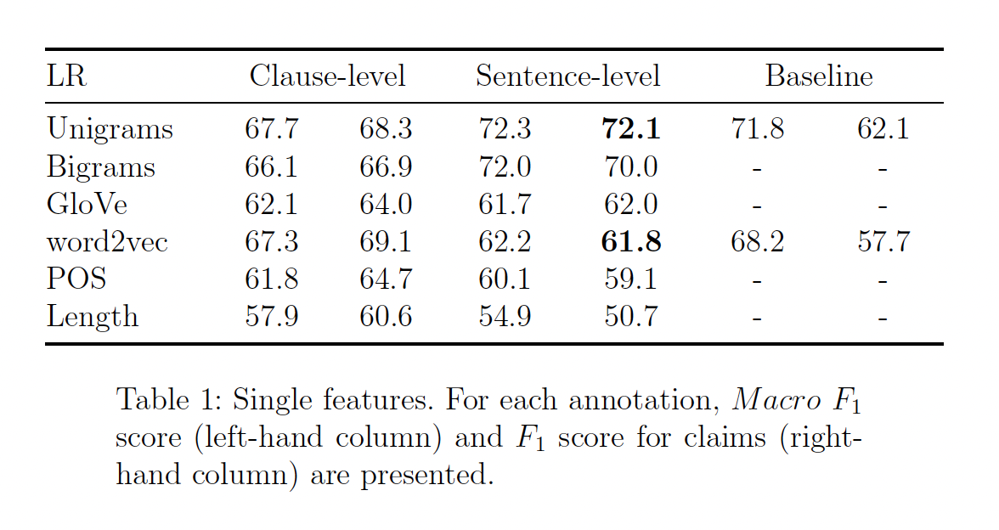
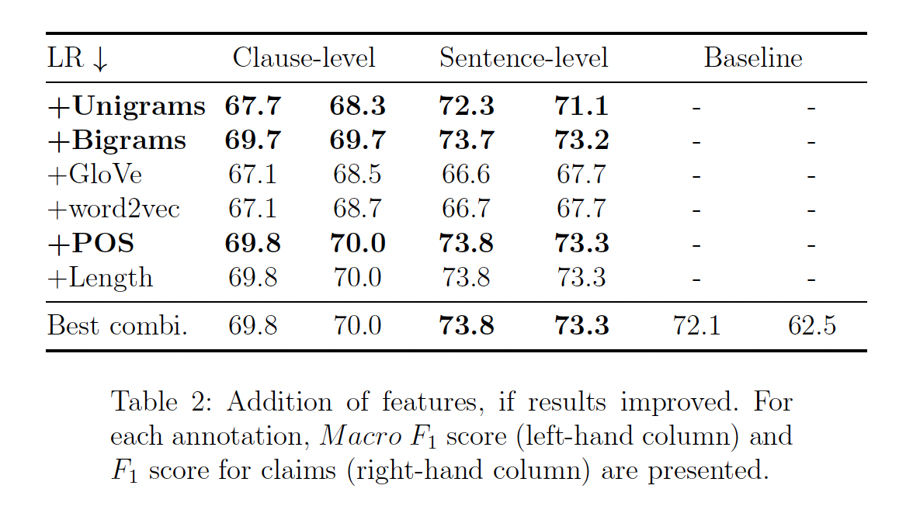
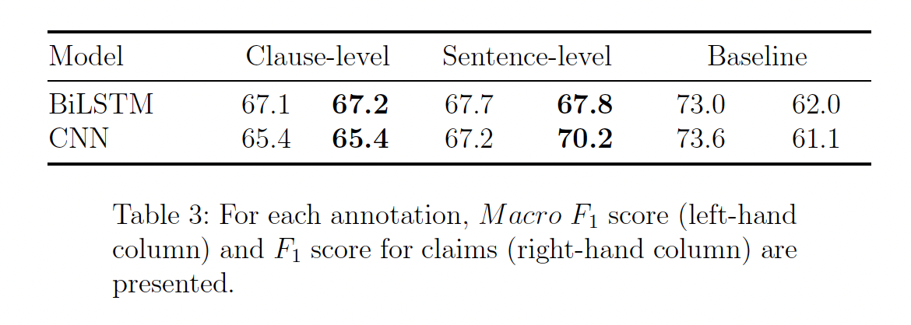
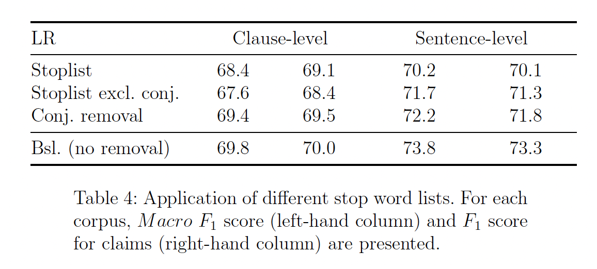

# Claim Detection Pipelines
This project presents a partial reproduction of "What is the Essence of a 
Claim? Cross-Domain Claim Identification." by Daxenberger et al. (2017). 
Unlike Daxenberger et al. (2017), whose goal is cross-domain classification, 
the focus is on an in-depth classification of claims from a single corpus, 
based on persuasive essays by Stab and Gurevych (2017a). Multiple 
classification pipelines are employed at the clause and sentence-level. 
Daxenberger's et al. (2017) baseline is still trailed by 1.7 with the best 
feature selection in this project's experiments. In addition, a different 
hyperparameter choice for BiLSTM and CNN classifiers could not improve the 
2017 results. Overall it turns out that classification at sentence-level is 
more fruitful. Additionally, the project investigates whether conjunctions and 
conjunctive adverbs play a distinctive role in automatically detecting claims, 
as they are often important signifiers for argumentative relations.

This repository contains the code for the project's experiments.

The pipelines can be found in their respective notebooks:

* feature_learning.ipynb
* deep_learning.ipynb

This code and documentation are published for research purposes. License: MIT.

## Corpus

The corpus is based on the Argument Annotated Essays (version 2)
by Stab and Gurevych (2017). At clause-level, it contains an annotated
set of 6089 statements that were written by students upon
prompts, as part of 402 persuasive essays. These statements are divided
into three groups: 1) Major Claim, 2) Claim, 3) Premise. Put
together, the corpus contains 2257 **claims** and 3832 **non-claims**. At
sentence level, the same corpus modified by Daxenberger et al. (2017)
contains 7051 sentences where 2093 are annotated as **claim** and 4958
as **non-claims**.

The corpora need to be downloaded manually and saved to /data.

## Installing Packages
This project uses *poetry* for managing dependencies. To install necessary 
packages for running the Jupyter Notebook, please use:

>poetry install

The feature based models use two types of pretrained embeddings: GloVe and 
word2vec. As these are relatively large files, they need to be added manually to /embeddings. 

## Results

As this paper follows Daxenberger et al. (2017), two groups of classifier
models are used: 1) Logistic Regression with hand-selected features,
2) two neural networks: one BiLSTM network and one CNN.
The instances from the corpora are downsampled to have equal set
sizes for each target.

## Resources

- Johannes Daxenberger, Steffen Eger, Ivan Habernal, Christian Stab, and Iryna
Gurevych. 2017. What is the Essence of a Claim? Cross-Domain Claim Identification.
In Proceedings of the 2017 Conference on Empirical Methods in Natural
Language Processing, pages 2055–2066, Copenhagen, Denmark. Association for
Computational Linguistics.

- Christian Stab and Iryna Gurevych. 2017. Argument Annotated Essays (version
2). https://tudatalib.ulb.tu-darmstadt.de/handle/tudatalib/2422. Last
accessed 23 December 2023.
